# GeekCode Benchmark Report

_Auto-generated comparison of 7 agents across 4 domains._

## Overall Scores

| Agent | Coding | Finance | Healthcare | General/Research | Overall |
|---|---|---|---|---|---|
| Aider | 84 | — | — | — | **84** |
| ChatGPT CLI | — | 73 | 70 | 73 | **72** |
| Claude Code | 86 | — | — | — | **86** |
| Codex CLI | 83 | — | — | — | **83** |
| GeekCode | 90 | 83 | 78 | 84 | **84** |
| Gemini CLI | — | 68 | 65 | 69 | **67** |
| Perplexity | — | 70 | 67 | 72 | **70** |

## Domain Comparison (Radar)

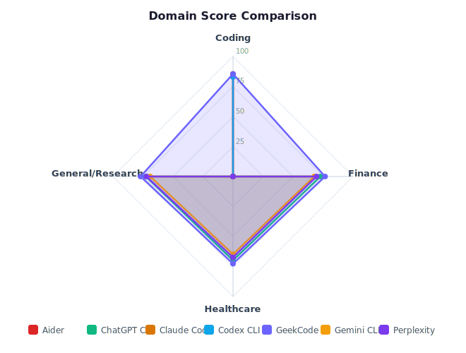

## Metrics Summary

| Agent | Domains | Tasks | Avg Latency (s) | Avg Tokens/Task | Resume | Model Switch |
|---|---|---|---|---|---|---|
| Aider | 1 | 20 | 11.35 | 3,138 | 0% | 0% |
| ChatGPT CLI | 3 | 60 | 28.71 | 3,968 | 0% | 0% |
| Claude Code | 1 | 20 | 13.67 | 3,425 | 0% | 0% |
| Codex CLI | 1 | 20 | 13.82 | 3,087 | 0% | 0% |
| GeekCode | 4 | 80 | 24.59 | 4,099 | 100% | 100% |
| Gemini CLI | 3 | 60 | 28.52 | 4,060 | 0% | 0% |
| Perplexity | 3 | 60 | 25.34 | 3,435 | 0% | 0% |

## Feature Comparison

| Feature | GeekCode | Aider | ChatGPT CLI | Claude Code | Codex CLI | Gemini CLI | Perplexity |
|---|---|---|---|---|---|---|---|
| Filesystem State | ✅ | ❌ | ❌ | ❌ | ❌ | ❌ | ❌ |
| Resume After Close | ✅ | ❌ | ❌ | ❌ | ❌ | ❌ | ❌ |
| Token Caching | ✅ | ❌ | ❌ | ❌ | ❌ | ❌ | ❌ |
| Model Switching | ✅ | ❌ | ❌ | ❌ | ❌ | ❌ | ❌ |
| Workspace Queries | ✅ | ❌ | ❌ | ✅ | ❌ | ❌ | ❌ |
| Multi-Domain | ✅ | ❌ | ✅ | ❌ | ❌ | ✅ | ✅ |
| Open Source | ✅ | ✅ | ❌ | ❌ | ✅ | ❌ | ❌ |
| Local Models (Ollama) | ✅ | ✅ | ❌ | ❌ | ❌ | ❌ | ❌ |
| Edit-Test Loop | ✅ | ✅ | ❌ | ✅ | ✅ | ❌ | ❌ |
| MCPorter (lean MCP) | ✅ | ❌ | ❌ | ❌ | ❌ | ❌ | ❌ |

---

_Run benchmarks yourself: `geekcode` → `/benchmark run` → `/benchmark report`_

## Per-Domain Breakdown

### Coding

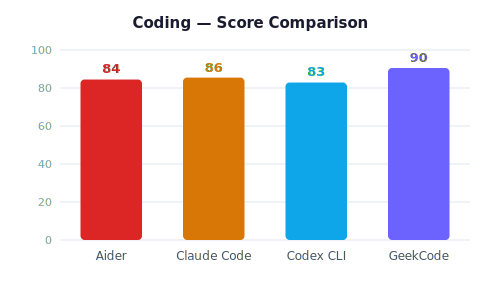

| Agent | Parse JSON Config | Add Unit Tests | Refactor Async/Await | Fix Race Condition | REST API Endpoint | Database Migration | Error Handling | Code Review Analysis | SQL Query Optimization | CI Pipeline Setup | Memory Leak Debug | Auth Middleware | API Documentation | Response Caching | Microservice Extract | Structured Logging | CSS Layout Fix | WebSocket Handler | Input Validation | Performance Profile | Avg |
|---|---|---|---|---|---|---|---|---|---|---|---|---|---|---|---|---|---|---|---|---|---|
| Aider | 80 | 85 | 82 | 83 | 87 | 87 | 82 | 83 | 88 | 88 | 84 | 83 | 86 | 85 | 81 | 86 | 86 | 82 | 87 | 86 | **84** |
| Claude Code | 85 | 84 | 86 | 86 | 82 | 85 | 89 | 89 | 87 | 82 | 86 | 82 | 86 | 84 | 85 | 84 | 89 | 86 | 85 | 88 | **86** |
| Codex CLI | 83 | 83 | 86 | 82 | 80 | 80 | 81 | 87 | 83 | 84 | 85 | 80 | 85 | 84 | 83 | 81 | 85 | 81 | 82 | 83 | **83** |
| GeekCode | 92 | 87 | 95 | 89 | 88 | 94 | 89 | 90 | 88 | 92 | 92 | 92 | 90 | 90 | 89 | 93 | 91 | 89 | 87 | 92 | **90** |

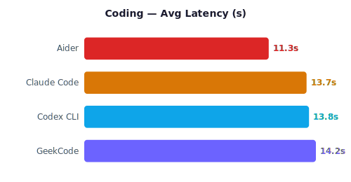
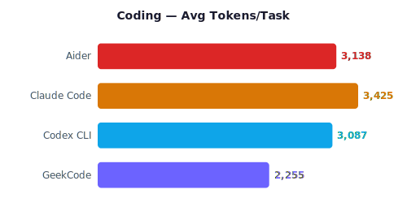

### Finance

| Agent | Policy Coverage | Premium Calculation | Risk Assessment | Claims Adjudication | Regulatory Compliance | Financial Statements | Portfolio Risk | Tax Implications | Exclusion Detection | Actuarial Tables | Fraud Patterns | Credit Scoring | Market Trends | Compliance Audit | Investment Review | Liability Assessment | Reinsurance Analysis | Loss Ratio Calc | Underwriting Rules | Financial Forecast | Avg |
|---|---|---|---|---|---|---|---|---|---|---|---|---|---|---|---|---|---|---|---|---|---|
| ChatGPT CLI | 73 | 72 | 71 | 75 | 72 | 76 | 72 | 76 | 68 | 76 | 75 | 74 | 73 | 76 | 74 | 68 | 72 | 74 | 68 | 71 | **73** |
| GeekCode | 83 | 86 | 85 | 80 | 87 | 77 | 82 | 85 | 77 | 85 | 86 | 80 | 86 | 80 | 83 | 85 | 77 | 83 | 87 | 80 | **83** |
| Gemini CLI | 69 | 66 | 72 | 66 | 71 | 66 | 66 | 72 | 69 | 65 | 70 | 63 | 63 | 69 | 68 | 70 | 64 | 72 | 63 | 70 | **68** |
| Perplexity | 67 | 66 | 72 | 73 | 68 | 68 | 76 | 67 | 67 | 76 | 70 | 71 | 67 | 69 | 73 | 75 | 68 | 67 | 66 | 66 | **70** |

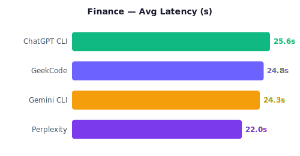
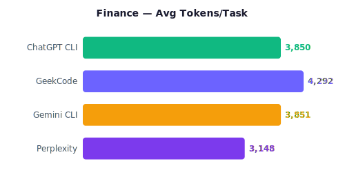

### Healthcare

| Agent | Clinical Guidelines | Drug Interactions | ICD-10 Coding | Prior Authorization | Medical Necessity | Treatment Protocol | Patient Eligibility | Claims Rules | Formulary Check | Adverse Events | Care Pathways | Quality Metrics | HIPAA Compliance | Utilization Review | Discharge Planning | Population Health | Trial Matching | Record Summary | Benefit Plans | Provider Credentials | Avg |
|---|---|---|---|---|---|---|---|---|---|---|---|---|---|---|---|---|---|---|---|---|---|
| ChatGPT CLI | 69 | 73 | 68 | 73 | 67 | 69 | 71 | 70 | 72 | 73 | 71 | 74 | 72 | 68 | 67 | 68 | 67 | 67 | 71 | 68 | **70** |
| GeekCode | 79 | 79 | 78 | 76 | 79 | 83 | 76 | 80 | 78 | 74 | 76 | 74 | 79 | 76 | 77 | 80 | 74 | 77 | 82 | 76 | **78** |
| Gemini CLI | 67 | 67 | 68 | 68 | 64 | 68 | 62 | 65 | 61 | 68 | 63 | 63 | 65 | 64 | 62 | 63 | 61 | 69 | 65 | 64 | **65** |
| Perplexity | 65 | 66 | 63 | 70 | 73 | 68 | 64 | 72 | 63 | 72 | 64 | 66 | 64 | 72 | 63 | 65 | 64 | 73 | 71 | 70 | **67** |

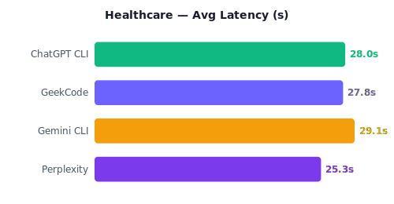
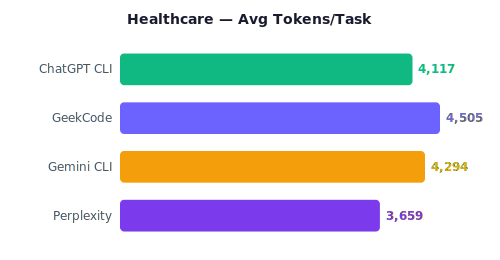

### General/Research

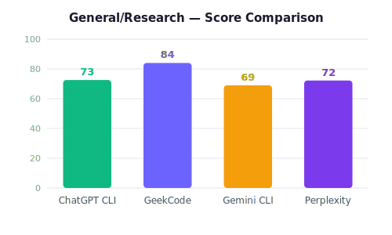

| Agent | Literature Review | Data Synthesis | Trend Analysis | Comparative Study | Executive Summary | Multi-Source Research | Policy Brief | Technical Report | Gap Analysis | Stakeholder Analysis | SWOT Analysis | Competitive Intel | Regulatory Landscape | Impact Assessment | Best Practices | Case Study | Cross-Domain Synthesis | Scenario Planning | Evidence Mapping | Strategic Recommendation | Avg |
|---|---|---|---|---|---|---|---|---|---|---|---|---|---|---|---|---|---|---|---|---|---|
| ChatGPT CLI | 75 | 75 | 72 | 74 | 68 | 76 | 69 | 70 | 67 | 72 | 67 | 77 | 74 | 76 | 67 | 73 | 77 | 72 | 74 | 77 | **73** |
| GeekCode | 85 | 89 | 87 | 82 | 80 | 86 | 83 | 82 | 80 | 84 | 86 | 88 | 81 | 85 | 88 | 80 | 81 | 86 | 85 | 83 | **84** |
| Gemini CLI | 71 | 65 | 70 | 70 | 66 | 74 | 70 | 73 | 71 | 67 | 72 | 66 | 66 | 70 | 64 | 74 | 66 | 70 | 71 | 65 | **69** |
| Perplexity | 68 | 75 | 73 | 72 | 76 | 72 | 76 | 76 | 64 | 75 | 77 | 63 | 74 | 67 | 68 | 76 | 77 | 74 | 76 | 64 | **72** |

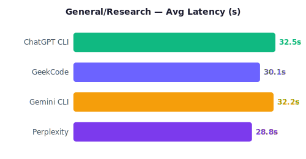
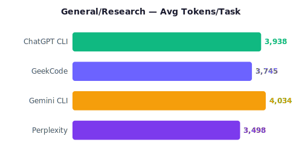
